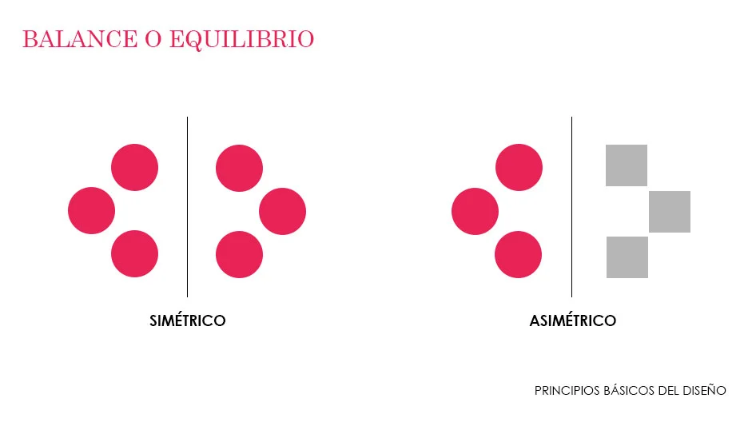
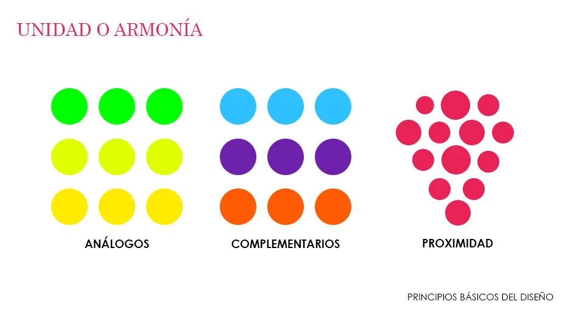
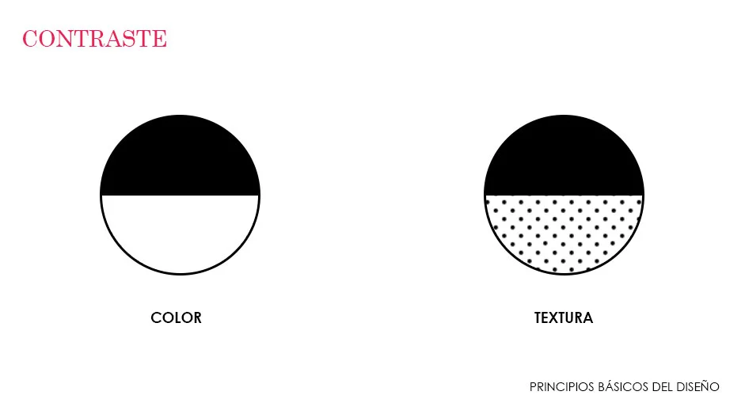
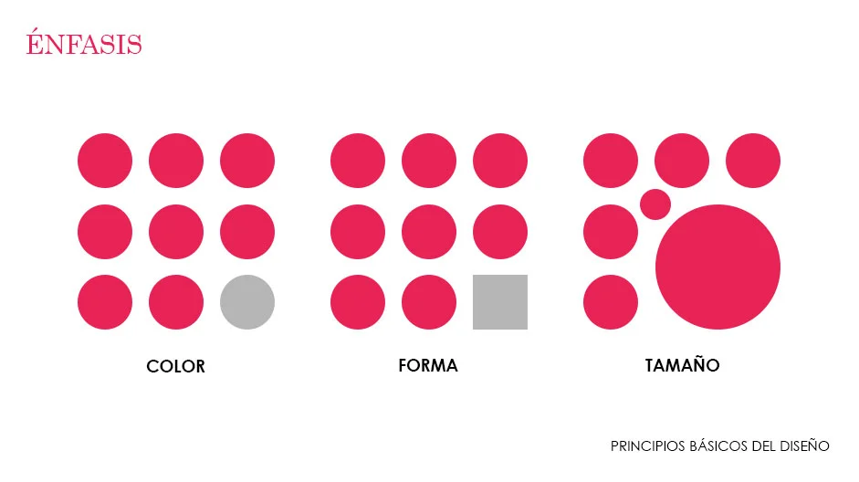
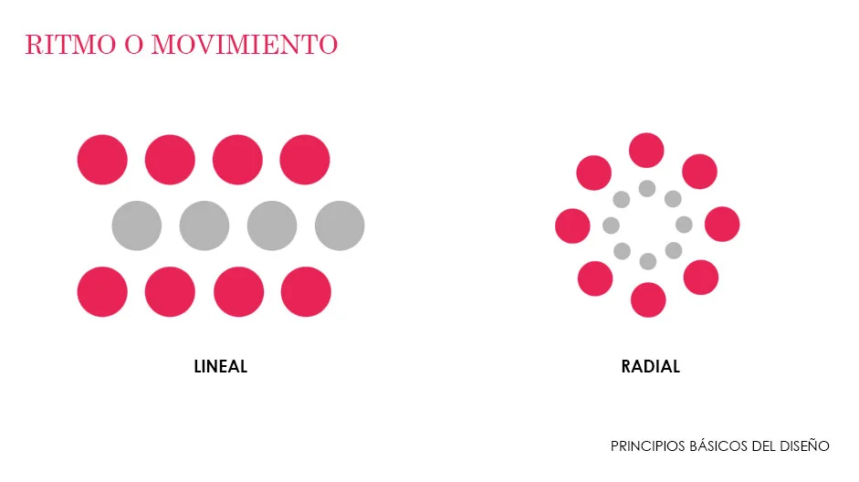
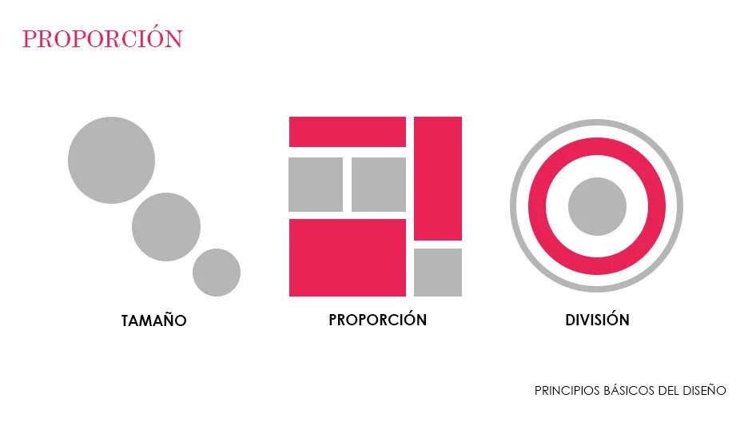

## Que hace que un diseño funcione?

Cada diseño tiene una estructura que hace que funcione, una estructura oculta  
Cada pieza del diseño tiene que tener un proposito

## Balance
Cada elemento en la pagina tiene un "peso" y eso puede ser a traves de cantidad de elementos, escalas, formas, colores e incluso texturas 

El balance puede hacernos tener la sensación de que el diseño se inclina para un lado

## Unidad
La unidad se refiere a como los elementos se relacionan de la forma mas organica posible  
Por ejemplo los elementos, el estilo y paleta de colores pueden ayudarnos a este fin

## Contraste
El contraste nos ayuda a cerar jerarquias en los diseños, mediante colores, formas y texturas  
El contraste puede crear un punto de foco  

## Enfasis
Se puede lograr mediante el uso del color para poder resaltar un elemento en particular del diseño  
Colores, lineas y elementos positivos y negativos  
Siempre que tengamos contraste tendremos enfasis  
Por lo que entiendo podemos usar el contraste sobre un elemento para hacerlo resaltar

## Repeticion
Simplemente repetir el mismo elemento en el diseño para crear unidad  
En Branding la repeticion crea coherencia

## Patrones
Se trata de la repeticion de multiples elementos  
Los patrones ayudan a mejorar la experiencia del espectador

Los patrones ayudan a crear una atmosfera a traves del diseño

## Ritmo
Es el "tempo" visual de la pieza grafica  
El ritmo ayudar a crear movimiento de forma organizada  
No notaremos el ritmo a menos que descompongamos el diseño en cada una da sus piezas.  
El ritmo es la repeticion de los elementos sin un patron

## Movimiento
Es el camino que toma la mirada para recorrer nuestro diseño  
Si somos inteligentes con el movimiento lo usaremos para guiar al espectador de como "leer" la pieza grafica

## Proporcion
La proporcion se crea cuando todos los elementos de una composicion se relacionan correctamente, logran armonia y equilibrio.  
La proporción nos dice que elemento es mas importante

## Armonía
Es la sensacion de coherencia entre los elementos de la composicion  
Se logra mediante paleta de colores, letras, estilos

## Variedad
Mezclar elementos es sorprender al espectador, si realza el tema de la comosicion se puede lograr algo muy interesante
